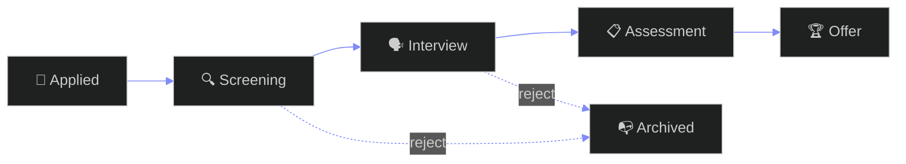

<div align="center">


[](https://github.com/Manashjyoti-Bora/devhire-pro-ats)&nbsp;
[](https://github.com/Manashjyoti-Bora/devhire-pro-ats)

</div>

> [!NOTE]
> **A lab notebook, not a product pitch.** I built this to answer one question: *can I engineer the dense, stateful interfaces that real hiring tools need?* Below is what the experiment covered.

---

## 🔬 EXPERIMENTS CONDUCTED

| # | UI PROBLEM | WHAT I BUILT |
|:---:|:---|:---|
| 01 | Filtering large datasets without lag | Real-time multi-attribute filters (role, stack, salary, location) |
| 02 | Information density vs. readability | Card grid with progressive disclosure — details on demand |
| 03 | Theming at component level | Glassmorphic light/dark themes, CSS variables end to end |
| 04 | Pipeline state visualization | Application tracker: applied → screening → interview → offer |
| 05 | Zero-backend state | Deterministic seeded data + client state that behaves like an API |

## 📐 PIPELINE MODEL



## 🔧 RUN IT LOCALLY

```bash
git clone https://github.com/Manashjyoti-Bora/devhire-pro-ats.git
cd devhire-pro-ats && npm install && npm run dev
```

## 🧾 LAB CONCLUSIONS

- Complex filter UIs are a **state design** problem before they are a UI problem
- React 19 + Vite gives instant feedback loops — ideal for UI iteration on a phone
- Next iteration: persist pipeline state to a real backend (pattern proven in [NexusMart](https://github.com/Manashjyoti-Bora/nexusmart))

<div align="center">

*Part of my learning-in-public series — every repo answers a question.*

<sub>Banner and animations on this page are hand-coded SVG — no generator services.</sub>

</div>
